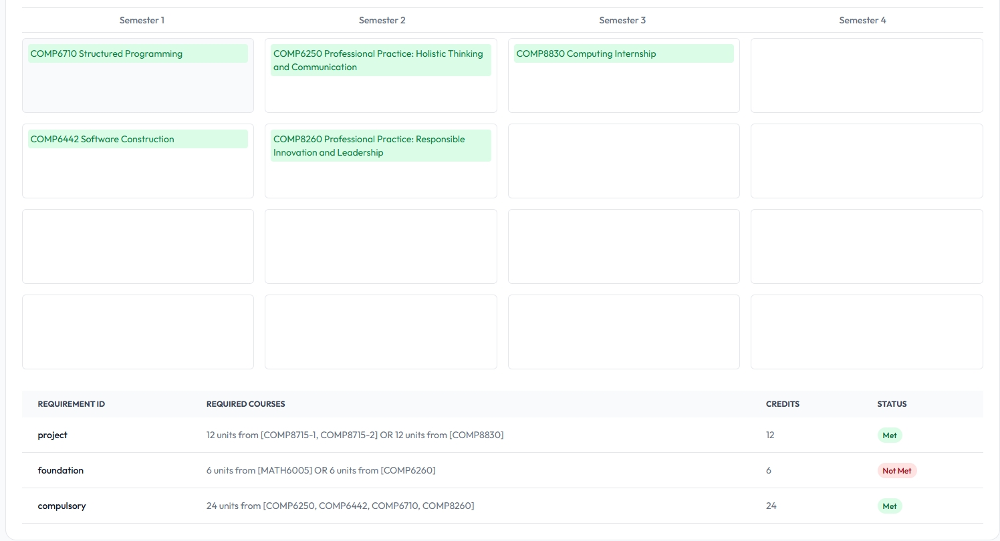

# ANU Graduation Requirement Checker Dashboard

[GradTrack Website](https://gradtrack.herman-tang.com)

GradTrack is designed for ANU students to plan their course arrangements against degree graduation requirements. It provides a visual way to check whether their current study plan allows them to graduate on time.

Since some courses are only offered in Semester 1 or Semester 2, and some may not be available in a given year, failing to plan ahead could delay graduation. Unexpected issues, such as failing a course, may also require students to re-plan their degree.



## Overview

GradTrack provides essential UI components and layouts for building feature-rich, data-driven admin dashboards and
control panels. It's built on:

Frontend
- React 19
- TypeScript
- Tailwind CSS
- S3 + Cloudfront (with ACM Certificates)

Backend
- .Net (C#)
- DynamoDB
- Docker + Lambda

## Local Installation

### Prerequisites

To get started with frontend, ensure you have the following prerequisites installed and set up:

- Node.js 18.x or later (recommended to use Node.js 20.x or later)

To get started with backend, install .Net from the official website.

1. Start the Backend Server:

   ```bash
   cd apps/backend/GraduationPlannerApi
   dotnet run
   ```

2. Start the Frontend Server:
   ```bash
   cd apps/frontend
   yarn install
   yarn dev
   ```

## 📝 Uploading Course Data to DynamoDB (Manual Setup)

Before using the app, you may want to populate the DynamoDB table with course data. Here's how to do it manually:

### Step 1: Ensure Your Backend Is Running

Make sure you have the backend project running:

```bash
dotnet run --project apps/backend/GraduationPlannerApi
```

> This assumes you're using a monorepo setup with the backend under `apps/backend`.

---

### Step 2: Prepare Your Data

Ensure the `semester_courses.json` file is placed in the `GraduationPlannerApi` root folder. This file should contain a list of course objects structured like this:

```json
[
  {
    "CourseCode": "COMP1234",
    "Name": "Example Course",
    "Availability": "S1 Only",
    "Prerequisites": ["COMP1000"],
    "IsLevel8": false,
    "Credit": 6
  }
]
```

---

### Step 3: Trigger the Upload Endpoint

Send a POST request to the upload endpoint:

```
POST http://localhost:5157/api/upload/courses
```

You can do this via:
- Postman
- `curl`:
  ```bash
  curl -X POST http://localhost:5157/api/upload/courses
  ```

If successful, you will get:

```
Courses uploaded successfully.
```

> This endpoint calls `BulkUploadCoursesAsync()` which reads the JSON file and saves each course entry into DynamoDB.

## 🚀 Deployment (Frontend & Backend)

GradTrack uses **two separate CloudFormation stacks** for deployment:  
1. **Backend stack** (`Herman-GradTrack-Backend`)  
2. **Frontend stack** (`Herman-GradTrack-Frontend`)  

### 1️⃣ Backend Stack
The backend deploys:
- Lambda (Docker container)  
- API Gateway (HTTP API)  
- DynamoDB tables (`Courses`, `GraduationRequirements`)  
- IAM roles/policies  

The CloudFormation template is:  
- apps/infrastructure/infrastructure.yml


Deployment is automated via GitHub Actions:  
- Workflow: **`.github/workflows/deploy-backend.yml`**
- Trigger:  
  - Push changes to `main` affecting `apps/backend/` or `infrastructure-backend.yml`
  - Manual dispatch

**What it does:**  
1. Builds and pushes Lambda Docker image to Amazon ECR  
2. Deploys/updates CloudFormation stack `Herman-GradTrack-Backend`  
3. Retains DynamoDB data (using `DeletionPolicy: Retain`)  

### 2️⃣ Frontend Stack
The frontend deploys:
- S3 bucket (hosting the SPA)  
- CloudFront distribution (with Route53 and ACM SSL cert)  
- Automatic API forwarding (all `/api/*` calls → API Gateway from backend stack)

The CloudFormation template is:  
- apps/infrastructure/infrastructure-frontend.yml

Deployment is automated via GitHub Actions:  
- Workflow: **`.github/workflows/deploy-frontend.yml`**
- Trigger:  
  - Push changes to `main` affecting `apps/frontend/` or `infrastructure-frontend.yml`
  - Manual dispatch

**What it does:**  
1. Builds React frontend using `vite build`  
2. Deploys/updates CloudFormation stack `Herman-GradTrack-Frontend`  
3. Uploads built files to the S3 bucket  
4. Invalidates CloudFront cache to serve new files immediately  

### 3️⃣ API URL (Frontend ↔ Backend)
- Frontend code uses `VITE_API_URL` environment variable  
- During production build, it’s overridden to `""` so CloudFront automatically forwards API requests to the backend

---

### 🔧 Manual Deployment (optional)

If you want to manually deploy (not via GitHub Actions):  
```bash
# Backend
aws cloudformation deploy \
  --stack-name Herman-GradTrack-Backend \
  --template-file apps/infrastructure/infrastructure.yml \
  --capabilities CAPABILITY_NAMED_IAM

# Frontend
aws cloudformation deploy \
  --stack-name Herman-GradTrack-Frontend \
  --template-file apps/infrastructure/infrastructure-frontend.yml \
  --capabilities CAPABILITY_NAMED_IAM
```
## 🔐 CI access with GitHub OIDC + AWS STS (no long‑lived secrets)

This repository uses **GitHub OpenID Connect (OIDC)** to let workflows obtain **temporary AWS credentials** from **AWS STS**.  
Benefits:
- **No stored AWS secrets** in GitHub  
- **Short‑lived** credentials (automatically expire)  
- Trust restricted to specific **repository** and **branch** (least privilege)

### How it works (high level)
1. The workflow requests an **OIDC token** from GitHub for the job (`permissions: id-token: write`).  
2. The action `aws-actions/configure-aws-credentials@v4` sends that token to **AWS STS** with **AssumeRoleWithWebIdentity**.  
3. STS returns **temporary credentials** for the IAM role that trusts the GitHub OIDC provider.  
4. Subsequent AWS CLI/SDK calls in the job use those temporary creds.
  